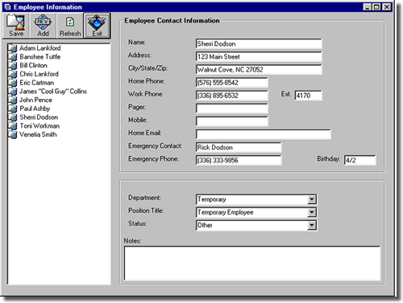



## Employee Contact Manager

### Description

This application will allow businesses to track employee contacts. This is a simple application that could be modified to a company's needs.
 
### More Info
 
The user can input contact attributes for an employee contact.

             |
---                |---
**Submitted On**   |2001-12-06 16:23:26
**By**             |[Adam T\. Lankford](https://github.com/Planet-Source-Code/PSCIndex/blob/master/ByAuthor/adam-t-lankford.md)
**Level**          |Intermediate
**User Rating**    |4.8 (43 globes from 9 users)
**Compatibility**  |VB 6\.0
**Category**       |[Complete Applications](https://github.com/Planet-Source-Code/PSCIndex/blob/master/ByCategory/complete-applications__1-27.md)
**World**          |[Visual Basic](https://github.com/Planet-Source-Code/PSCIndex/blob/master/ByWorld/visual-basic.md)
**Archive File**   |[Employee\_C398841262001\.zip](https://github.com/Planet-Source-Code/adam-t-lankford-employee-contact-manager__1-29532/archive/master.zip)

